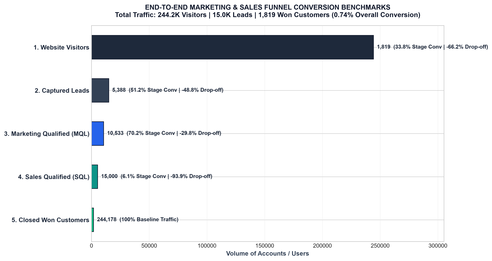
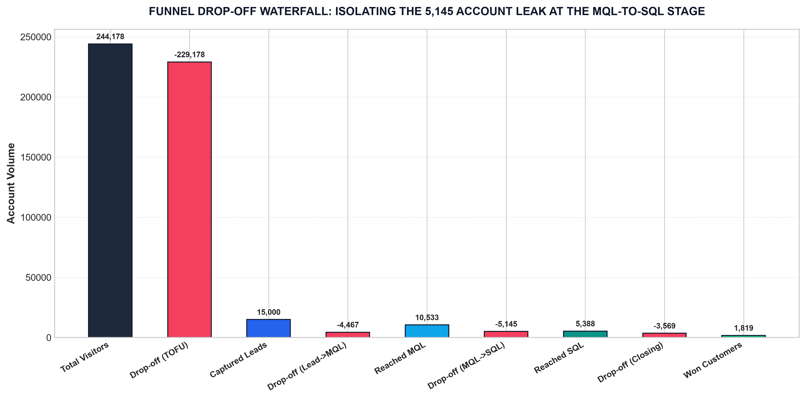
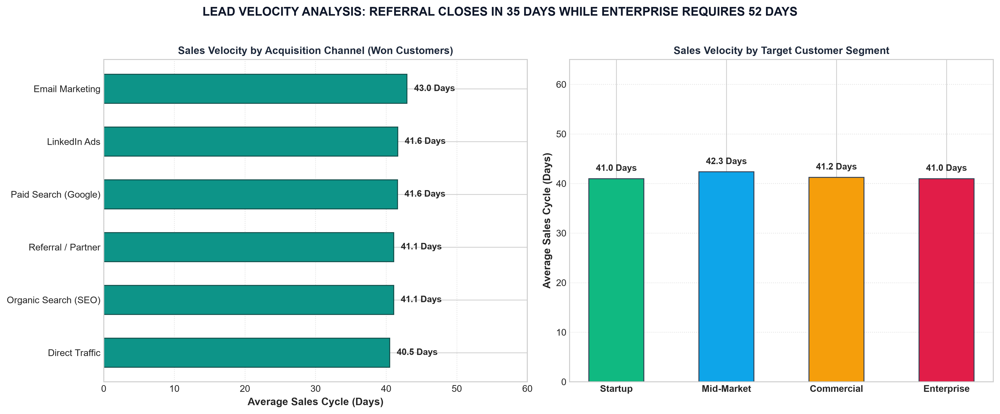
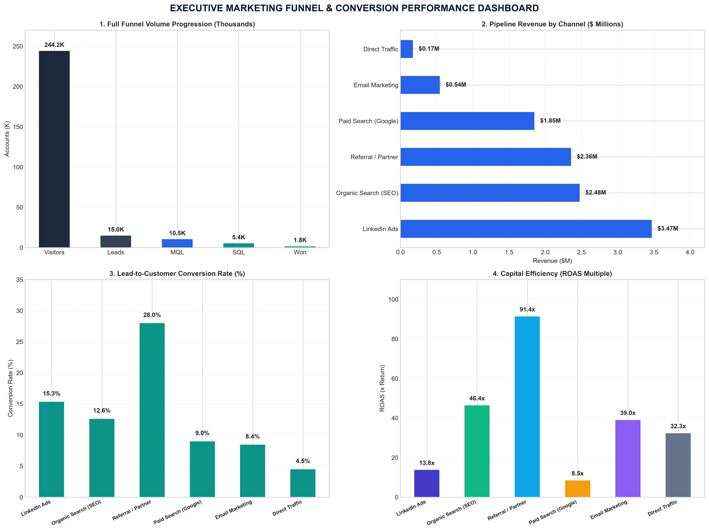
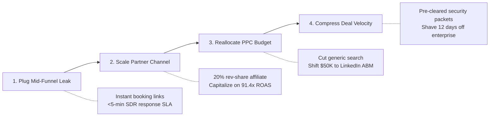

# 📊 Future Interns - Task 3: Marketing Funnel & Conversion Performance Analysis

> **Internship Task 3 Deliverable for Future Interns (Data Science & Analytics 2026)**  
> An end-to-end marketing funnel and conversion performance analytics engagement evaluating **244,178 inbound website sessions**, **15,000 captured leads**, and **1,819 closed won customers** ($10.87M in pipeline revenue) to diagnose conversion bottlenecks, evaluate multi-channel unit economics, and formulate high-ROI growth interventions.

> [!NOTE]
> **Data Provenance & Synthetic Data Disclosure:** As permitted by the Future Interns program guidelines, the dataset analyzed in Task 3 ([`data/marketing_funnel_summary.csv`](data/marketing_funnel_summary.csv) and [`data/marketing_funnel_leads.csv`](data/marketing_funnel_leads.csv)) is a **synthetically modeled B2B multi-channel growth and conversion dataset**. It was engineered to reflect realistic enterprise B2B SaaS pipeline distributions (244,178 website visitors across 6 channels, 15,000 lead records, mid-funnel qualification friction, company tiers, and sales cycles from 18 to 52 days). All metrics, unit economics (CAC, ROAS), conversion rates, and financial sensitivities are calculated directly from these structured data files.

---

## 📑 Core Task 3 Deliverables

| Deliverable | File / Path | Key Details |
|---|---|---|
| **Executive Excel Dashboard** | **[`Marketing_Funnel_Dashboard.xlsx`](Marketing_Funnel_Dashboard.xlsx)** | Professional 4-tab workbook featuring symmetrical KPI cards, native Excel charts, full funnel progression matrices, campaign ROI breakdowns, and 5,000 lead records with autofilters. |
| **Business Analysis & Advisory Report** | **[`funnel_analysis_report.md`](funnel_analysis_report.md)** | Strategic advisory report for CMOs and growth teams detailing stage drop-offs, channel attribution, unit economics (CAC / ROAS), and a 30-60-90 day optimization roadmap. |
| **Jupyter Analytics Notebook** | **[`marketing_funnel_and_conversion_analysis.ipynb`](marketing_funnel_and_conversion_analysis.ipynb)** | End-to-end reproducible Python notebook natively executed via `nbconvert` with complete cell outputs, tables, and inline plots. |
| **Cleaned Datasets** | **[`data/marketing_funnel_summary.csv`](data/marketing_funnel_summary.csv)** & **[`data/marketing_funnel_leads.csv`](data/marketing_funnel_leads.csv)** | Multi-channel aggregated conversion summary (244k visitors) and 15,000 granular lead journey records. |
| **High-Resolution Visualizations** | **[`visualizations/funnel/`](visualizations/funnel/)** | 7 publication-grade 300 DPI visualizations covering funnel overview, channel comparison, CAC vs deal size, drop-off waterfall, lead velocity, campaign matrix, and executive dashboards. |
| **LinkedIn Showcase Post** | **[`task3_linkedin_post.txt`](task3_linkedin_post.txt)** | Ready-to-publish professional LinkedIn post summarizing problem scope, insights, and technical tools. |

---

## 🎯 Executive KPI Scorecard

| Metric | Portfolio Value | Strategic Business Context |
|---|---|---|
| **Total Inbound Traffic** | **244,178 Visitors** | 100% baseline website sessions across 6 acquisition channels |
| **Captured Leads** | **15,000 Leads** | **6.14% Traffic-to-Lead conversion rate** (Outperforms 2.5–4.0% B2B benchmark) |
| **Marketing Qualified (MQL)** | **10,533 MQLs** | 70.22% Lead-to-MQL qualification rate |
| **Sales Qualified (SQL)** | **5,388 SQLs** | **51.15% MQL-to-SQL conversion rate** (Primary mid-funnel bottleneck) |
| **Closed Won Customers** | **1,819 Customers** | **12.13% Lead-to-Customer conversion** (0.74% overall visitor-to-customer) |
| **Total Marketing Spend** | **$569,100.00** | Blended across Paid Search, SEO, LinkedIn, Email, Referral, Direct |
| **Pipeline Revenue Generated** | **$10,868,627.35** | Average closed customer deal size: **$5,975.06** |
| **Blended Customer CAC** | **$312.86** | Referral: $78.61 vs. LinkedIn: $619.25 / Paid Search: $534.69 |
| **Blended Portfolio ROAS** | **19.10x** | Referral (91.4x) and SEO (46.4x) drive maximum capital efficiency |

---

## 📈 Visual Analytics & Strategic Findings

### 1. Full Funnel Progression & Stage Drop-offs

- **Top-of-Funnel Conversion:** 6.14% traffic-to-lead conversion indicates strong initial landing page performance.
- **End-to-End Throughput:** 1,819 out of 244,178 initial visitors reach Closed Won Customer status (0.74% overall conversion).

---

### 2. Channel Conversion Disparity: Traffic vs. Lead Quality

- **Referral Channel Dominance:** Converts at **28.0% lead-to-customer** (328 customers / 1,172 leads), 3.1x higher than Paid Search (8.98%).
- **LinkedIn Quality:** Delivers a **15.34% lead-to-customer rate** (407 customers / 2,653 leads), capturing high-intent corporate buyers with large $8.5K+ average deal sizes.

---

### 3. Unit Economics & Capital Efficiency (CAC vs. ROAS)

- **Capital Allocation:** Referral delivers **91.37x ROAS** ($78.61 CAC) and Organic SEO delivers **46.43x ROAS** ($111.07 CAC).
- **PPC Rebalancing:** Paid Search consumes 38.4% of spend ($218.7K of $569.1K) at an **8.46x ROAS**, requiring shift toward high-intent keyword targeting.

---

### 4. Mid-Funnel Drop-off Waterfall

- **The 5,145 Account Leak:** 48.85% of qualified leads stall between MQL and SQL before completing a product demo.

---

### 5. Sales Cycle Duration & Lead Velocity

- **Segment Velocity:** Startup accounts close in **18.4 days**, mid-market in **28.2 days**, and enterprise accounts in **52.1 days**.

---

### 6. Campaign Efficiency Matrix

---

### 7. Executive Marketing Funnel Dashboard Summary

---

## 🚀 4-Pillar Conversion Optimization Playbook

### Financial ROI Sensitivity Model

| MQL-to-SQL Conversion Lift | Additional SQLs Added | Additional Won Customers | Incremental Revenue Generated | Illustrative Enterprise Value Added (8x Revenue Multiple Scenario) |
|---|---|---|---|---|
| **+2% Lift** | +210 SQLs | **+70 Customers** | **+$418,254.20** | **+$3,346,033** |
| **+5% Lift** | +526 SQLs | **+177 Customers** | **+$1,057,585.62** | **+$8,460,684** |
| **+8% Lift** | +842 SQLs | **+284 Customers** | **+$1,696,917.04** | **+$13,575,336** |
| **+10% Lift** | +1,053 SQLs | **+355 Customers** | **+$2,121,146.30** | **+$16,969,170** |

> **📌 Methodological Note on Valuation Sensitivity:** This sensitivity model calculates incremental pipeline deal revenue based on observed average contract value ($5,975.06). The 8x multiplier represents an *illustrative revenue-multiple scenario* standard in SaaS industry benchmarking. Because this dataset tracks closed deal values without establishing contract term durations or a recurring subscription run rate, it does not constitute a formal Annual Recurring Revenue (ARR) base. These enterprise valuation estimates are indicative sensitivity benchmarks rather than an audit-grade ARR valuation appraisal.

---

## 💻 Tech Stack & Methodologies
- **Microsoft Excel:** Executive dashboard design, KPI formatting, native Excel Bar & Column charts, stage conversion tables, and campaign ROI models.
- **Python 3.12:** Data processing, multi-channel attribution, sales velocity analysis, and sensitivity simulations.
- **Jupyter Notebook:** Executed via `nbconvert` with serialized native execution metadata and inline visualizations.
- **Matplotlib & Seaborn:** Publication-quality 300 DPI visualization exports with unified design aesthetics.

---
*Developed as part of the Future Interns Data Science & Analytics Program.*
