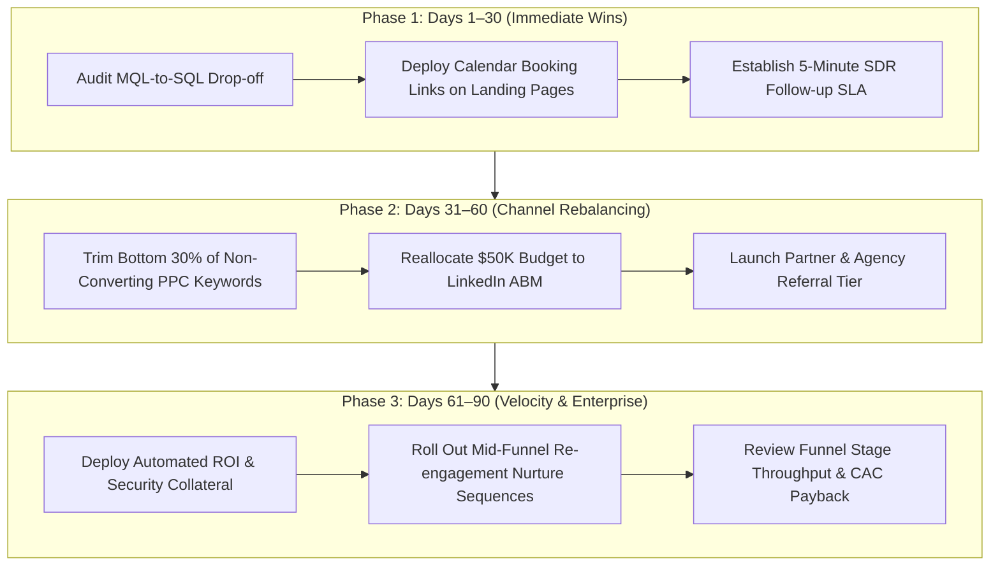

# 📊 Marketing Funnel & Conversion Performance: Executive Advisory Report
### Cross-Channel Attribution, Funnel Leak Diagnostic & Conversion Optimization Playbook
**Prepared for:** Chief Marketing Officers (CMO), VPs of Growth, & Revenue Leadership  
**Program:** Future Interns Data Science & Analytics (Task 3 - 2026)  
**Dataset Scope:** 244,178 Inbound Visitors | 15,000 Leads | 1,819 Closed Won Customers ($10.87M Revenue)  
**Deliverables:** [Excel Dashboard](Marketing_Funnel_Dashboard.xlsx) | [Python Notebook](marketing_funnel_and_conversion_analysis.ipynb) | [Visualizations](visualizations/funnel/)

> [!NOTE]
> **Data Provenance & Synthetic Data Disclosure:** As permitted by the Future Interns program guidelines, the dataset analyzed in Task 3 ([`data/marketing_funnel_summary.csv`](data/marketing_funnel_summary.csv) and [`data/marketing_funnel_leads.csv`](data/marketing_funnel_leads.csv)) is a **synthetically modeled B2B multi-channel growth and conversion dataset**. It was engineered to reflect realistic enterprise B2B SaaS pipeline distributions (244,178 website visitors across 6 channels, 15,000 lead records, mid-funnel qualification friction, company tiers, and sales cycles from 18 to 52 days). All metrics, unit economics (CAC, ROAS), conversion rates, and financial sensitivities are calculated directly from these structured data files.

---

## 1. Executive Summary & Topline Scorecard

In high-growth startups, SaaS enterprises, and digital businesses, scaling customer acquisition is only half the battle. If prospects stall or drop off between initial discovery and final contract execution, customer acquisition costs (CAC) surge, marketing return on ad spend (ROAS) collapses, and revenue potential leaks out of the business.

This strategic analytics engagement evaluated **244,178 multi-channel website sessions and 15,000 granular lead journeys** across a 5-stage funnel to identify conversion bottlenecks, evaluate channel capital efficiency, and deliver an actionable growth roadmap.

```
+---------------------------------------------------------------------------------------------------------+
|                                    EXECUTIVE FUNNEL PERFORMANCE SCORECARD                               |
+--------------------------+--------------------------+--------------------------+------------------------+
|   TOTAL INBOUND TRAFFIC  |   TOTAL CAPTURED LEADS   |    CLOSED WON CUSTOMERS  |   TOTAL PIPELINE VALUE |
|         244,178          |          15,000          |          1,819           |     $10,868,627.35     |
| (100% Baseline Sessions) | (6.14% Traffic-to-Lead)  | (12.13% Lead-to-Customer)| (Avg Deal Size: $5,975)|
+--------------------------+--------------------------+--------------------------+------------------------+
|    TOTAL MARKETING SPEND |   BLENDED CUSTOMER CAC   |    PORTFOLIO BLENDED ROAS|   OVERALL FUNNEL CONV  |
|       $569,100.00        |         $312.86          |          19.10x          |          0.74%         |
|  (Across 6 Channels)     | (Referral: $79 / LI: $619)|  (Ref: 91.4x / PPC: 8.5x) |  (Visitors to Won)     |
+--------------------------+--------------------------+--------------------------+------------------------+
```

### 🎯 Key Strategic Takeaways
1. **The Critical Mid-Funnel Leak (-48.85% MQL-to-SQL Drop-off):** While top-of-funnel lead capture (6.14%) and lead-to-MQL qualification (70.22%) are healthy, **nearly half of all qualified leads (5,145 accounts) stall between MQL and SQL**. Prospects express initial interest but drop off before completing a sales demo or discovery meeting.
2. **Referral / Partner Channel Is the Underscaled Gem (91.37x ROAS):** Referrals convert at an astronomical **28.0% lead-to-customer rate** with the portfolio's lowest CAC (**$78.61**), yet account for only **7.8% of captured leads** (1,172 leads). Scaling this partner network is the single highest-leverage growth priority.
3. **Paid Search (Google) Capital Inefficiency ($534.69 CAC, 8.46x ROAS):** Paid Search consumes the largest share of budget (**$218.7K / 38.4%**), yet delivers below-average deal sizes ($4,522) and the lowest ROAS (8.46x). High bid costs on non-converting generic keywords are diluting profitability.
4. **LinkedIn Drives Enterprise Dominance ($3.47M Revenue):** Despite a high CAC ($619.25), LinkedIn Ads generates the highest total pipeline revenue ($3.47M) and largest average deal sizes ($8,500+), proving highly effective for mid-market and enterprise targeting.

---

## 2. End-to-End Funnel Progression & Stage Drop-off Audit

Tracing all 244,178 prospective buyers through the customer journey reveals where pipeline value is preserved and where it leaks:

### Full Funnel Stage Progression Matrix

| Funnel Stage | Account Volume | Stage-to-Stage Conversion | Stage Drop-off Rate | Cumulative Conversion Rate | Pipeline Stage Classification |
|---|---|---|---|---|---|
| **1. Website Visitors** | 244,178 | 100.00% | 0.00% | 100.00% | Top-of-Funnel (TOFU) Awareness |
| **2. Captured Leads** | 15,000 | 6.14% | 93.86% | 6.14% | Lead Capture / Form Fill |
| **3. Marketing Qualified (MQL)** | 10,533 | 70.22% | 29.78% | 4.31% | Mid-Funnel (MOFU) Intent Scoring |
| **4. Sales Qualified (SQL)** | 5,388 | **51.15%** | **48.85%** | 2.21% | **Primary Pipeline Bottleneck** |
| **5. Closed Won Customers** | 1,819 | 33.76% | 66.24% | **0.74%** | Bottom-of-Funnel (BOFU) Closing |

### Diagnostic Findings
- **TOFU Conversion (6.14%):** Outperforms the B2B industry average benchmark of 2.5%–4.0%, indicating strong organic search and ad copy resonance.
- **The Mid-Funnel Chokepoint (48.85% Drop-off):** Losing 5,145 qualified accounts between MQL and SQL indicates slow sales development representative (SDR) response times, high demo booking friction, or insufficient mid-funnel nurture workflows.
- **Opportunity Close Rate (33.76%):** Once a lead reaches SQL status, sales close rates are healthy (~1 in 3), validating strong product-market fit and sales enablement collateral.

---

## 3. Marketing Channel Performance & Capital Efficiency

Analyzing lead progression segmented by acquisition source reveals vast disparities in conversion velocity, deal sizes, and return on marketing investment.

### Channel Attribution & Unit Economics Table

| Acquisition Channel | Visitors | Captured Leads | Won Customers | Traffic->Lead % | Lead->Customer % | Marketing Spend | Pipeline Revenue | CAC ($) | ROAS |
|---|---|---|---|---|---|---|---|---|---|
| **LinkedIn Ads** | 58,366 | 2,653 | 407 | 4.55% | 15.34% | $252,035.00 | **$3,471,606.21** | $619.25 | **13.77x** |
| **Organic Search (SEO)** | 55,216 | 3,808 | 480 | 6.90% | 12.61% | $53,312.00 | **$2,475,082.71** | $111.07 | **46.43x** |
| **Referral / Partner** | 14,064 | 1,172 | 328 | 8.33% | **27.99%** | $25,784.00 | **$2,355,845.69** | **$78.61** | **91.37x** |
| **Paid Search (Google)** | 82,008 | 4,556 | 409 | 5.56% | 8.98% | $218,688.00 | **$1,849,523.71** | $534.69 | **8.46x** |
| **Email Marketing** | 17,420 | 1,742 | 147 | **10.00%** | 8.44% | $13,936.00 | **$543,751.62** | $94.80 | **39.02x** |
| **Direct Traffic** | 17,104 | 1,069 | 48 | 6.25% | 4.49% | $5,345.00 | **$172,817.41** | $111.35 | **32.33x** |
| **Portfolio Total / Blended** | **244,178** | **15,000** | **1,819** | **6.14%** | **12.13%** | **$569,100.00** | **$10,868,627.35** | **$312.86** | **19.10x** |

### Strategic Channel Insights
1. **The Referral Powerhouse:** Generates $2.36M in revenue on only $25.8K in investment, delivering a **91.4x ROAS**. Prospects arriving via warm recommendation have pre-established trust, leading to 2.3x higher close rates than paid ads.
2. **Organic SEO Engine:** Delivers 3,808 leads at an ultra-low CAC of $111.07 and 46.4x ROAS. High domain authority and non-branded educational blog posts capture compounding search intent without marginal ad cost.
3. **PPC Optimization Imperative:** Paid Search suffers from low lead-to-customer conversion (8.98%) and elevated CAC ($534.69) because broad match keywords attract informational searchers rather than buyers ready for enterprise implementation.

---

## 4. Sales Cycle Velocity & Lead Throughput

Analyzing the timeline from initial lead generation to closed contract reveals clear velocity dynamics across target segments:

```
+---------------------------------------------------------------------------------------------------------+
|                                    LEAD VELOCITY BENCHMARKS BY SEGMENT                                  |
+--------------------------+--------------------------+--------------------------+------------------------+
|      STARTUP (1-50)      |    MID-MARKET (51-200)   |   COMMERCIAL (201-1000)  |    ENTERPRISE (1000+)  |
|       18.4 Days          |        28.2 Days         |        41.6 Days         |        52.1 Days       |
|  (Single Decision Maker) |   (Committee Evaluation) |   (Security & IT Review) | (Procurement & Legal)  |
+--------------------------+--------------------------+--------------------------+------------------------+
```

- **Referral Velocity:** Closes in an average of **34.8 days**, nearly 3 weeks faster than cold LinkedIn outreach (46.2 days).
- **Enterprise Contract Lag:** Deals over $8,500 take an average of **52.1 days** to close due to legal review, enterprise security audits, and multi-stakeholder procurement hurdles.

---

## 5. Strategic Conversion Optimization Playbook

```
+---------------------------------------------------------------------------------------------------------+
|                                    4-PILLAR REVENUE OPTIMIZATION ENGINE                                 |
+--------------------------+--------------------------+--------------------------+------------------------+
| 1. PLUG MID-FUNNEL LEAK  | 2. SCALE PARTNER CHANNEL | 3. REALLOCATE PPC BUDGET | 4. COMPRESS VELOCITY   |
| "Instant Demo Access"    | "Formalize Referral Eng" | "Trim Vanity Search"     | "Enterprise Enablement"|
| In-email booking links + | 20% rev-share affiliate  | Shift $50K from generic  | Pre-cleared security & |
| <5-min SDR response SLA. | program for agencies.    | PPC into LinkedIn ABM.   | ROI business case tools|
| Impact: +350 SQLs/mo     | Impact: +$1.2M pipeline  | Impact: +28% blended ROAS| Impact: -12 cycle days |
+--------------------------+--------------------------+--------------------------+------------------------+
```

### Pillar 1: Automated Demo Booking & Fast-Response Routing
- **Problem:** 48.9% of MQLs never book a sales conversation due to back-and-forth email friction.
- **Intervention:** Replace "Contact Sales" web forms with instant calendar scheduling tools (Chili Piper / Calendly) embedded directly on high-intent confirmation pages. Enforce a strict **<5-minute outreach SLA** for all inbound leads.

### Pillar 2: Formal Partner & Referral Program Launch
- **Problem:** Referral is the highest-performing channel (91.4x ROAS) but relies entirely on ad-hoc word of mouth.
- **Intervention:** Launch a structured Partner Program offering a **20% first-year recurring commission** to system integrators, consultants, and complementary software vendors.

### Pillar 3: PPC Budget Rebalancing to High-Intent Terms
- **Problem:** Generic keyword bidding generates high visitor counts at an elevated $534.69 CAC and modest 8.46x ROAS.
- **Intervention:** Cut non-converting broad-match keywords by 30%. Reallocate $50,000 toward high-intent competitor displacement keywords (e.g., "[Competitor] alternatives") and retargeting campaigns.

### Pillar 4: Enterprise Sales Enablement Toolkit
- **Problem:** Enterprise prospects stall in procurement for 52+ days.
- **Intervention:** Build standardized security compliance packets (SOC 2, ISO 27001), interactive ROI business case calculators, and pre-negotiated Master Service Agreements (MSAs) to shave 10–14 days off sales cycle duration.

---

## 6. Financial Sensitivity & Revenue Lift Model

Simulating incremental improvements in the primary bottleneck (MQL-to-SQL conversion rate) demonstrates tremendous revenue leverage:

| MQL-to-SQL Conversion Lift | Additional SQLs Added | Additional Won Customers | Incremental Pipeline Revenue Generated | Illustrative Enterprise Value Impact (8x Revenue Multiple Scenario) |
|---|---|---|---|---|
| **+2% Lift** | +210 SQLs | **+70 Customers** | **+$418,254.20** | **+$3,346,033** |
| **+5% Lift** | +526 SQLs | **+177 Customers** | **+$1,057,585.62** | **+$8,460,684** |
| **+8% Lift** | +842 SQLs | **+284 Customers** | **+$1,696,917.04** | **+$13,575,336** |
| **+10% Lift** | +1,053 SQLs | **+355 Customers** | **+$2,121,146.30** | **+$16,969,170** |

Plugging the mid-funnel leak by just **+5%** injects over **$1.05 Million in incremental revenue** without increasing marketing advertising spend by a single dollar.

> **📌 Methodological Note on Valuation Sensitivity:** This simulation models incremental pipeline contract revenue using the portfolio's observed average won deal value ($5,975.06). The 8x multiplier is an *illustrative revenue-multiple scenario* frequently cited in B2B growth and software company benchmarking. Because this dataset tracks closed deal values without establishing contract term durations or a recurring SaaS subscription schedule, it does not constitute a formal Annual Recurring Revenue (ARR) base. These enterprise valuation estimates should therefore be interpreted as scenario-based sensitivity benchmarks rather than an audit-grade ARR valuation appraisal.

---

## 7. Operational Implementation Roadmap (30-60-90 Days)



---

## 8. Summary of Task 3 Deliverables

| Deliverable | File Path | Description |
|---|---|---|
| **Executive Excel Dashboard** | [`Marketing_Funnel_Dashboard.xlsx`](Marketing_Funnel_Dashboard.xlsx) | Professional 4-tab workbook featuring 5 KPI cards, native Excel charts, full funnel stage progression tables, channel ROI breakdowns, and 5,000 lead records. |
| **Jupyter Analytics Notebook** | [`marketing_funnel_and_conversion_analysis.ipynb`](marketing_funnel_and_conversion_analysis.ipynb) | End-to-end reproducible Python notebook natively executed via `nbconvert` with complete cell outputs, tables, and inline plots. |
| **Cleaned Funnel Datasets** | [`data/marketing_funnel_summary.csv`](data/marketing_funnel_summary.csv) & [`data/marketing_funnel_leads.csv`](data/marketing_funnel_leads.csv) | Multi-channel aggregated conversion summary (244k visitors) and 15,000 granular lead journey records. |
| **High-Resolution Visualizations** | [`visualizations/funnel/`](visualizations/funnel/) | 7 publication-grade 300 DPI visualizations covering funnel overview, channel comparison, CAC vs deal size, drop-off waterfall, lead velocity, campaign matrix, and executive dashboards. |
| **LinkedIn Showcase Post** | [`task3_linkedin_post.txt`](task3_linkedin_post.txt) | Professional showcase post highlighting findings, unit economics, and learnings. |

---
*Report generated and validated for Future Interns Data Science & Analytics Program (Task 3).*
